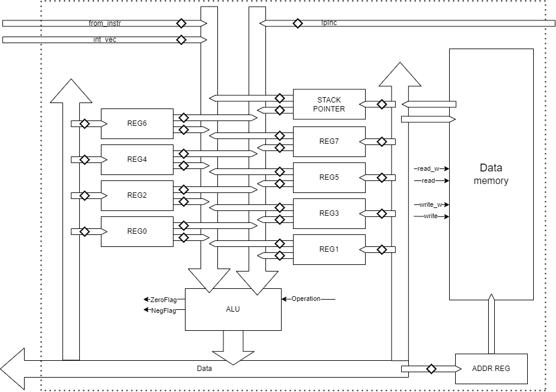

# ComputerArchitectureLab3
## Bulko Egor P3206

Variant: asm | risc | harv | hw | instr | struct | trap | port | cstr | prob1

Базовый вариант

## Язык программирования - Assembly-like
```
program ::= { line }

line ::= section_declaration "\n"
       | [ label ] instr [ comment ] "\n"
       | [ label ] data_command [ comment ] "\n"
       | label [ comment ] "\n"
       | [ comment ] "\n"

section_declaration ::= "section" section_type

section_typ ::= ".data"
              | ".code"


label ::= label_name ":"

comment ::= ";" <any symbols except "\n">

instr ::= instr_arg0
        | instr_arg1
        | instr_arg2
        | instr_arg3

instr_arg0 ::= "di"
             | "ei"
             | "ret"
             | "nop"
             | "halt"

instr_arg1 ::= "jmp" label_name
             | "be" label_name
             | "bne" label_name
             | "bg" label_name
             | "ble" label_name
             | "inc" reg_name
             | "call" label_name
             | "push" reg_name
             | "pop" reg_name

instr_arg2 ::= "mov" reg_name, reg_name
             | "movn" reg_name, int
             | "in" reg_name, port_id
             | "out" port_id, reg_name
             | "la" reg_name, label_name
             | "lw" reg_name, label_name
             | "lb" reg_name, label_name
             | "lwi" reg_name, reg_name
             | "lbi" reg_name, reg_name
             | "stw" label_name, reg_name
             | "stb" label_name, reg_name
             | "stwi" reg_name, reg_name
             | "stbi" reg_name, reg_name
             | "cmp" reg_name, reg_name
             | "test" reg_name, reg_name

instr_arg3 ::= "add" reg_name, reg_name, reg_name
             | "sub" reg_name, reg_name, reg_name
             | "mul" reg_name, reg_name, reg_name
             | "rem" reg_name, reg_name, reg_name
             | "and" reg_name, reg_name, reg_name

data_command ::= "byte" int
               | "char" char
               | "str" string
               | "vec" label_name

int ::= [ "-" ] { <any of "0-9"> }

char ::= <any symbols except "\n">

string ::= " {<any symbols except "\n">} "

port_id ::= 0 | 1

reg_name ::= reg0 
           | reg1 
           | reg2 
           | reg3 
           | reg4 
           | reg5 
           | reg6 
           | reg7

label_name ::= <any of "a-z A-Z _"> { <any of "a-z A-Z 0-9 _"> }
```
### Инструкции


#### Инструкции с памятью
`lw reg, addr` - Загрузить значение размером в 1 машинное слово из ячейки памяти с адресом __addr__ в регистр __reg__

`lb reg, addr` - Загрузить значение размером в 1 байт из ячейки памяти с адресом __addr__ в регистр __reg__

`lbi regt, regs` - Загрузить значение размером в 1 байт из ячейки памяти с адресом указанным в __regs__ в регистр __regt__

`stb addr, reg` - Загрузить младший байт из регистра __reg__ в память по адресу __addr__

`stw addr, reg` - Загрузить значение размером в 1 машинное слово из регистра __reg__ в память по адресу __addr__

`stbi regt, regs` - Загрузить младший байт из регистра __regs__ в память по адресу указанному в регистре __regt__

`stwi regt, regs` - Загрузить значение размером в 1 машинное слово из регистра __regs__ в память по адресу указанному в регистре __regt__

#### Операции стравнение

`cmp reg1, reg2` - Вычесть значение регистра __reg2__ из __reg1__ по получившемуся результаты выставить флаги состояния

`test reg1, reg2` - Выполнить операцию побитового или между значениями __reg1__ и __reg2__ по получившемуся результаты выставить флаги состояния

#### Инструкции ветвления

`jmp lbl` - Безусловный переход по адресу метки __lbl__

`be lbl` - Переход по адресу метки __lbl__, если флаг 'Z' равен 1 (branch if equals)

`bne lbl` - Переход по адресу метки __lbl__, если флаг 'Z' равен 0 (branch if not equals)

`bg lbl` - Переход по адресу метки __lbl__, если флаг 'Z' равен 0 и флаг 'N' равен 1 (branch if greater)

`ble lbl` - Переход по адресу метки __lbl__, если флаг 'Z' равен 1 или флаг 'N' равен 0 (branch if lover or equals)

#### Арифметические операции
`add regt, regs1, regs2` - Сложить значения регистров __regs1__ и __regs2__ и положить результат в __regt__

`sub regt, regs1, regs2` - Вычесть значение регистра __regs2__ из __regs1__ и положить результат в __regt__

`mul regt, regs1, regs2` - Перемножить значения регистров __regs1__ и __regs2__ и положить результат в __regt__

`rem regt, regs1, regs2` - Сложить значения регистров __regs1__ и __regs2__ и положить результат в __regt__

`and regt, regs1, regs2` - Сложить значения регистров __regs1__ и __regs2__ и положить результат в __regt__

`inc reg` - Прибавить 1 к значению регистра __reg__ и положить результат в __reg__

#### Стековые операции
`call lbl` - Вызвать подпрограмму по адресу метки __lbl__. Положив на стек адрес овзврата

`ret` - Вернуться из подпрограммы. Перейдя по адресу из стека

`push reg` - Положить значение регистра __reg__ на вершину стека.

`pop reg` - Загрузить значение из вершины стека в регистр __reg__

#### Операции ввода-вывода

`in reg, port` - Записать в __reg__ значение из шины ввода-вывода соответствующее внешнему устройству, подключенному к порту __port__

`out port, reg` - Передать значение регистра __reg__ через шину ввода-вывод устройству подключенному к порту __port__

`di` - Запретить процессору обрабатывать перывания внешних от устройств

`ei` - Разрешить процессору обрабатывать перывания внешних от устройств

#### Иные операции

`mov regt, regs` - Записать значение регистра __regs__ в __regt__

`movn reg, n` - Записать значение __n__ в регистр __reg__

`movn reg, lbl` - Записать адрес метки __lbl__ в регистр __reg__

`nop` - Не делать ничего (пустая операция)

`halt` - Остановить процессор

### Метки
Метки - алиасы для адресов памяти. 

```
label:         ; - определение метки
    jmp label  ; - использование меток в коде
```
На этапе трансляции метки заменяются численными адресами

## Организация памяти

Память организвана согласно Гарвардской модели, где память инструкций и память данных разделены

- Память инструкций представлена в виде высокоуровневой стрктуры данных, размер машинног слова не оперделен

- Память данных реализуется массивом байт, размер машинного слова - 4 байта

- Программисту доступна память данных для записи и чтения, а также регистры общего назначения (reg1 - reg6)

- Прерывания устанавливаются програмистом при написании программы. В памяти данных храмятся адреса подпрограм обработки прервыаний, так, что 4 * n - адрес обработки прерывания n-ого порта


## Транслятор
Реализация представлена в [translator](/translator/)
```
cargo run -- <source> [<target>]
```
Команда запуска симулции, где 
- source - има файла на языке программирования
- target (опционально) - имя файла куда будет загружен скомпилированный машинный код

Процесс [трансляции](/translator/src/translator/parser.rs) разделен на 2 этапа:
- parsing
  - Разбиение исходного кода на токены
  - удаление коментариев
  - Парсинг [команд](/translator/src/processor/commands.rs) и их аргументов
  - Обозначение меток
- linking 
  - Сопосталение меток реальным адресам
  - Превращение команд данных в набор байтов 


## Модель процессора
Реализация представлена в [processor](./processor/)
```
cargo run -- <source> <schedule> [<log>]
```
Команда запуска симулции, где 
- source - имя файла, содержащего результат трансляции программы (машинный код) 
- schedule - имя файла в формате json, содержащий расписание ввода в процессор
- log (опционально) - имя файля для вывода журнала работы процессора.

### Control Unit

На схеме пердставлена модель control unit-а, а также интерфайса ввода вывода

Схема включает в себя decoder, datapath, память инструкций, указатель инструкций, модуль вычисления адреса вектора прерываний, интерфейс ввода-вывода с портами 

Реализация CU предоставлена на языке Rust в файле [cpu.rs](/processor/src/cpu.rs) и дирректории [cpu](/processor/src/cpu/)

Симуляция исполнения инструкций реализована в [decoder.rs](/processor/src/cpu/decoder.rs) 

Реализация интерфейса ввода вывода представлена в [io](/processor/src/cpu/ports.rs)




На схеме предоставлена модель datapath

Схема включает в себя регистры общего назначения, указатель стека, регистр адреса, память данных и арифметико логическое устройство.

Все элементы схемы соединены 32 битными шинами. Передача на шину данных и считывание их с нее происходит пучем подачи логических сигналов на защелки.вентили.

В datapath из CU ведут 3 шины:
- шина данных инструкции
- шина адреса вектора прерываний
- шина адреса инструкции после инкрементации

Из datapath в CU ведет шина данных


## Тестирование
Тестирование происходит с использование golden tests в формате yaml файлов. Тесты лежат в папке [tests](/tests/)

Каждый тест содержит в себе:
- Исходный код на языке программирования
- Результат работы транслятора
- Консольный вывод
- Журнал работы процессора

Тесты представлены для следующий програм:
- [hello.asm](/asm_scripts/hello.asm)
- [cat.asm](/asm_scripts/cat.asm)
- [hello_username.asm](/asm_scripts/hello_username.asm)
- [prob1.asm](/asm_scripts/prob1.asm)